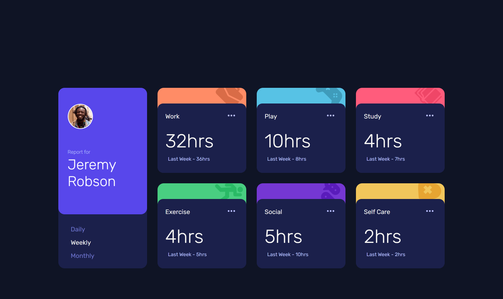
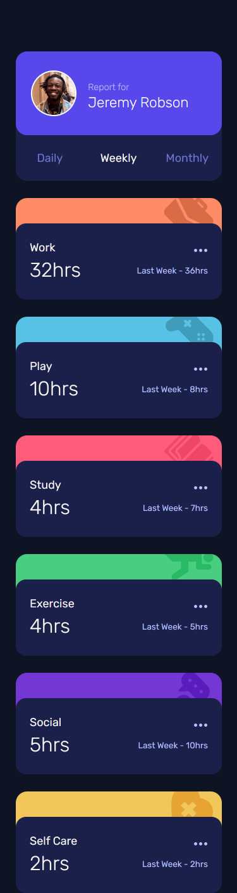

# Frontend Mentor - Time tracking dashboard solution

This is a solution to the [Time tracking dashboard challenge on Frontend Mentor](https://www.frontendmentor.io/challenges/time-tracking-dashboard-UIQ7167Jw). Frontend Mentor challenges help you improve your coding skills by building realistic projects.

## Table of contents

- [Overview](#overview)
  - [The challenge](#the-challenge)
  - [Screenshot](#screenshot)
  - [Links](#links)
- [My process](#my-process)
  - [Built with](#built-with)
- [Author](#author)

**Note: Delete this note and update the table of contents based on what sections you keep.**

## Overview

### The challenge

Users should be able to:

- View the optimal layout for the site depending on their device's screen size
- See hover states for all interactive elements on the page
- Switch between viewing Daily, Weekly, and Monthly stats

### Screenshot




### Links

- Solution URL: [GitHub](https://github.com/Devs-advocate/FEM-Time-Tracking-Dashboard)
- Live Site URL: [Vercel](https://fem-time-tracking-dashboard.vercel.app/)

## My process

I started with the HTML layout with consideration of both the mobile and desktop versions. JavaScript was then used to add the dynamic functionality of fetching and changing styles upon user input. Some basic CSS was added during the addition of JS, but was mainly left till last.

### Built with

- Semantic HTML5 markup
- CSS custom properties
- CSS Grid
- Mobile-first workflow

### What I learned

I used this challenge to practice asynchronous JavaScript using fetch, as well as DOM manipulation. CSS is quite vast and therefore practicing it more and more is always necessary. I learned more about the background property and using the shorthand to color and position an SVG URL.

```css
#work {
  background: var(--orange) url('./images/icon-work.svg') no-repeat 95% -12%;
}
```

```js
async function getHours(url, reportPeriod) {
  try {
    let response = await fetch(url);
    if (!response) {
      throw new Error(`Response status: ${response.status}`);
    }
    let data = await response.json();
    data.forEach((item) => {
      current = item.timeframes[reportPeriod]['current'];
      previous = item.timeframes[reportPeriod]['previous'];
      renderData(current, previous, item.title);
    });
  } catch (error) {
    console.log(error.message);
  }
}
```

## Author

- Frontend Mentor - [@Devs-advocate](https://www.frontendmentor.io/profile/yourusername)
